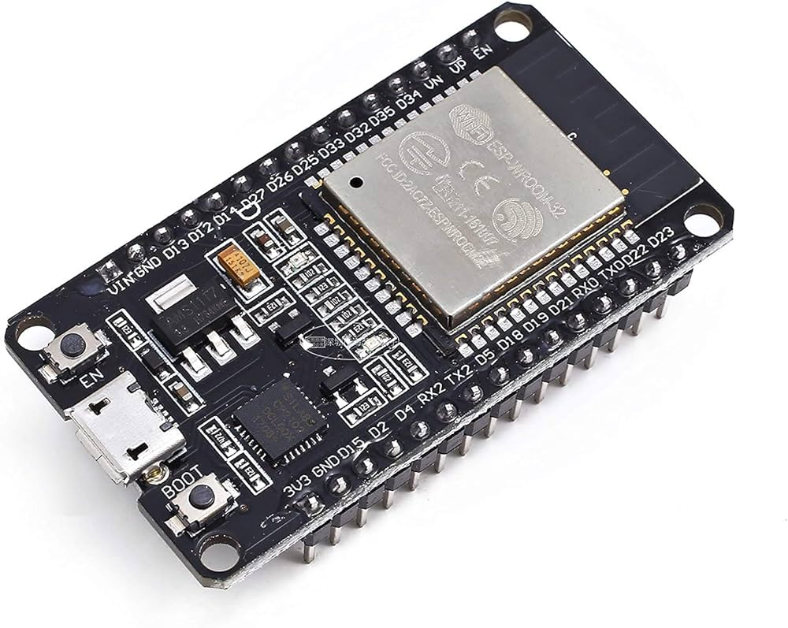
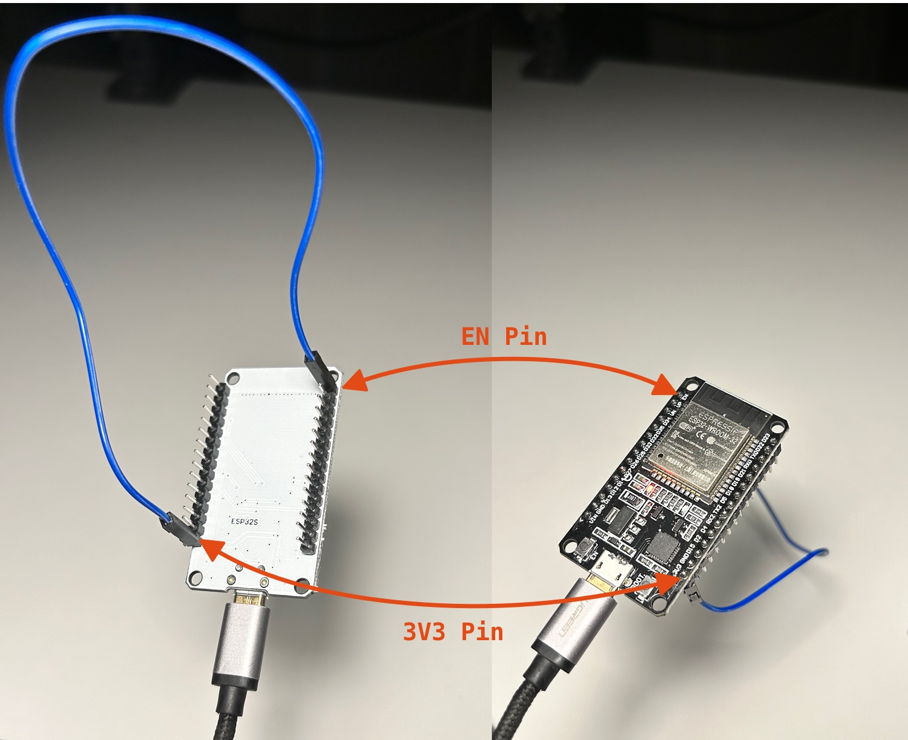

# ESP32-WROOM-32



You can use precompiled `ESP32-WROOM-32` application included in this directory to flash it with `esptool.py` like below:

``` bash
$ esptool.py --chip auto --baud 921600 --before default_reset --after hard_reset write_flash -u --flash_mode dio --flash_freq 40m --flash_size detect 0x1000 misc/esp32/bootloader.bin 0x8000 misc/esp32/partitions.bin 0x10000 misc/esp32/esp32-hci-uart-app.bin
```

**Enviromental Variables**
``` bash
# Export Baudrate (Precompiled example is using 921600)
export BLUETOOTH_HCI_SOCKET_UART_BAUDRATE=921600
# Export UART port (Linux or MAC) on Windows set to COMx
export BLUETOOTH_HCI_SOCKET_UART_PORT=/dev/tty.usbserial-0001
```

This is Zephyr [`hci_uart` example](https://github.com/zephyrproject-rtos/zephyr/tree/main/samples/bluetooth/hci_uart) with the following configuration:

**samples/bluetooth/hci_uart/boards/esp32_devkitc_wroom.conf**
``` 
CONFIG_CONSOLE=n
CONFIG_STDOUT_CONSOLE=n
CONFIG_UART_CONSOLE=n

CONFIG_BT_MAX_CONN=7
CONFIG_LOG=n

CONFIG_BT_BUF_CMD_TX_COUNT=48
CONFIG_BT_BUF_ACL_RX_COUNT=48
CONFIG_BT_BUF_ACL_TX_COUNT=48
CONFIG_BT_BUF_EVT_RX_COUNT=48
CONFIG_BT_BUF_EVT_DISCARDABLE_SIZE=255

CONFIG_BT_BUF_ACL_RX_SIZE=255
CONFIG_BT_BUF_ACL_TX_SIZE=255
CONFIG_BT_BUF_CMD_TX_SIZE=255
CONFIG_BT_BUF_EVT_RX_SIZE=255

CONFIG_BT_DATA_LEN_UPDATE=y
```

**samples/bluetooth/hci_uart/boards/esp32_devkitc_wroom.overlay**
``` 
/ {
	chosen {
		zephyr,bt-c2h-uart = &uart0;
	};
};

&uart0 {
	status = "okay";
	current-speed = <921600>;
	pinctrl-0 = <&uart0_default>;
	pinctrl-names = "default";
};
```

**Build using `west` (Zephyr)**
```
$ west build -p auto -b esp32_devkitc_wroom zephyr/samples/bluetooth/hci_uart
$ west flash
```

In order to NOT reboot `ESP32` board every time when connecting to the `UART` port it could be required to connect `EN` pin to `3V3` pin like below:

