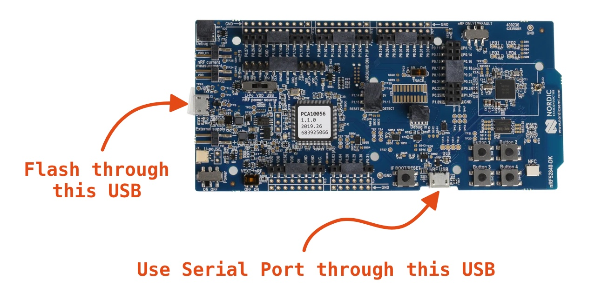
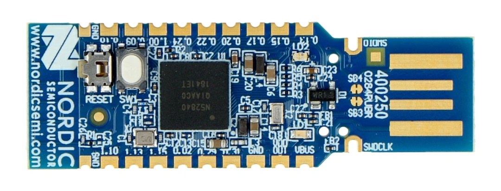

# NRF52840



You can use precompiled `NRF52840` application included in this directory to flash it with `nrfjprog` tool like below:

``` bash
$ nrfjprog -f NRF52 --program misc/nrf52840/nrf52840-hci-uart-app.hex –-chiperase --reset
```

After flashing it through the USB (shorter edge) you have to plug the cable to the other USB (long edge) and you should see the USB device name same as `CONFIG_USB_DEVICE_PRODUCT` variable.

**Enviromental Variables**
``` bash
# Export Baudrate (Precompiled example is using 1000000)
export BLUETOOTH_HCI_SOCKET_UART_BAUDRATE=1000000
# Export UART port (Linux or MAC) on Windows set to COMx
export BLUETOOTH_HCI_SOCKET_UART_PORT=/dev/tty.usbmodem...
```

This is Zephyr [`hci_uart` example](https://github.com/zephyrproject-rtos/zephyr/tree/main/samples/bluetooth/hci_uart) with the following configuration:

**samples/bluetooth/hci_uart/boards/nrf52840dk_nrf52840.conf**
``` 
CONFIG_USB_DEVICE_STACK=y
CONFIG_USB_DEVICE_PRODUCT="Zephyr HCI UART"
CONFIG_USB_CDC_ACM=y
CONFIG_USB_DEVICE_INITIALIZE_AT_BOOT=n

CONFIG_BT_MAX_CONN=5

CONFIG_USE_SEGGER_RTT=n
CONFIG_RTT_CONSOLE=n
CONFIG_LOG=n

CONFIG_BT_BUF_CMD_TX_COUNT=64
CONFIG_BT_BUF_ACL_RX_COUNT=64
CONFIG_BT_BUF_ACL_TX_COUNT=200
CONFIG_BT_BUF_EVT_RX_COUNT=255
CONFIG_BT_BUF_EVT_DISCARDABLE_SIZE=255

CONFIG_BT_BUF_ACL_RX_SIZE=255
CONFIG_BT_BUF_ACL_TX_SIZE=255
CONFIG_BT_BUF_CMD_TX_SIZE=255
CONFIG_BT_BUF_EVT_RX_SIZE=255

CONFIG_BT_CTLR=y
CONFIG_BT_CTLR_CRYPTO=y
CONFIG_BT_CTLR_LE_ENC=y
CONFIG_BT_CTLR_PRIVACY=y
CONFIG_BT_CTLR_FILTER_ACCEPT_LIST=y
CONFIG_BT_CTLR_DTM_HCI=y
CONFIG_BT_CTLR_ADVANCED_FEATURES=y
CONFIG_BT_CTLR_PARAM_CHECK=y
CONFIG_BT_CTLR_PROFILE_ISR=y

CONFIG_BT_DATA_LEN_UPDATE=y
```

**samples/bluetooth/hci_uart/boards/nrf52840dk_nrf52840.overlay**
``` 
/ {
	chosen {
		zephyr,bt-c2h-uart = &cdc_acm_uart0;
	};
};

&zephyr_udc0 {
	cdc_acm_uart0: cdc_acm_uart0 {
		compatible = "zephyr,cdc-acm-uart";
		label = "CDC_ACM_0";
		current-speed = <1000000>;
		hw-flow-control;
	};
};
```

**Build using `west` (Zephyr)**
```
$ west build -p auto -b nrf52840dk_nrf52840 zephyr/samples/bluetooth/hci_uart
$ west flash
```

You can also use `NRF52` usb dongle like below with the same `hex` file.

